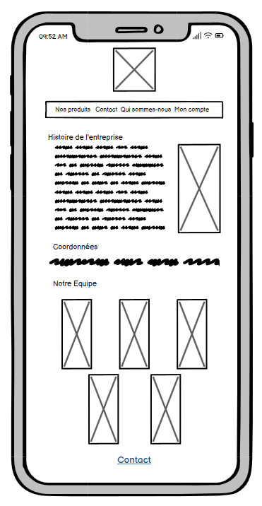

# Charte graphique

## Logo

Affichez le logo ici.
image: 

## Couleurs

Listez les couleurs utilisées ci-après en donnant les valeurs en hexadécimal.
@Northern-Lights-1-hex: #164773;
@Northern-Lights-2-hex: #0B2B40;
@Northern-Lights-3-hex: #1E5959;
@Northern-Lights-4-hex: #3B8C6E;
@Northern-Lights-5-hex: #89D99D;

## Icônes

Listez toutes vos icônes ici.
<svg width="32" height="32" viewBox="0 0 24 24"><path fill="currentColor" d="M12 2C6.48 2 2 6.48 2 12s4.48 10 10 10s10-4.48 10-10S17.52 2 12 2zm0 4c1.93 0 3.5 1.57 3.5 3.5S13.93 13 12 13s-3.5-1.57-3.5-3.5S10.07 6 12 6zm0 14c-2.03 0-4.43-.82-6.14-2.88a9.947 9.947 0 0 1 12.28 0C16.43 19.18 14.03 20 12 20z"/></svg>

## Polices

Listez toutes vos polices ici (avec le lien direct depuis Google Font).

Spécifiez à quels éléments doivent être appliqué chaque police.
https://fonts.google.com/specimen/Bebas+Neue?category=Display&subset=latin&noto.script=Latn - h1 - 20px

https://fonts.google.com/specimen/Bebas+Neue?category=Display&subset=latin&noto.script=Latn - h2 - 18px

https://fonts.google.com/specimen/Comfortaa - body

## Maquettes

Affichez toutes vos maquettes ici au format images (png ou jpeg).

